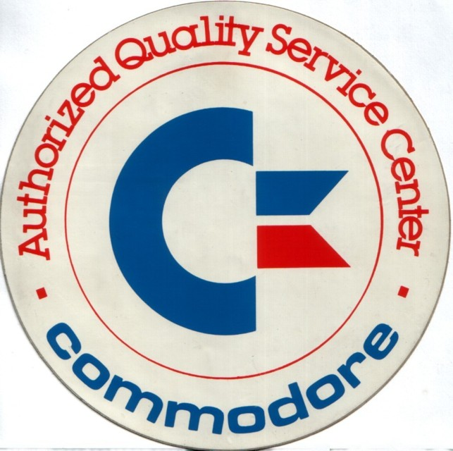

# Ray Carlsen Electronics

mirror from https://www.portcommodore.com/rcarlsen/

Excerpt from the website

---

CARLSEN ELECTRONICS

For repairs contact: Michael Myers: its.michael.myers [AT] gmail [DOT] com

Commodore 8 bit Computer repair information: [click here](./cbm/)

Commodore power supplies: [click here](./psu/customPS.jpg) for photos of new custom-built replacements

The C64 Computer "Saver", power adapters and A/V cables: [click here](/psu/cables.html) for photos

This site is dedicated to users of 8 bit Commodore Computer hardware. I had been doing consumer
electronics repair work since 1964. I retired from my "day" job as a repair tech at the University of
Washington in Seattle back in 2009 and likewise don't do consumer electronics repairs any longer.

Most recently I had to stop repairing Commodore hardware due to age (I'm 79), now acting as
main caregiver for my wife with Alzheimers... and I have a hand tremor. It was time to stop but
I'll continue to make power supplies until my stock of parts is depleted.

The information herein is listed in "directories". Each directory refers to a particular device such
as a C64 computer, and each contains all the repair articles, schematic diagrams, etc. I have for that
piece of equipment. Most repair articles are stored in standard text file format.

Ray Carlsen, website owner: [click here](./cbm/Ray/) for personal data 

My military experience at B-2-56, a US base in Germany 1965 - 1967, with photos  [click here](./cbm/Ray/MIL)

---
